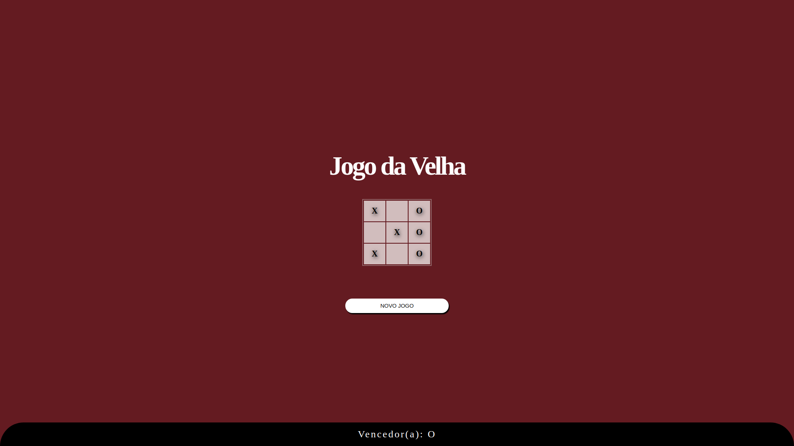

  

<h1 align="center"> 
    [ X ] <strong>Jogo da velha</strong> [ O ]
</h1>

## **Projeto**

 O mais popular jogo da velha

## **Desenvolvimento**

	O projeto foi desenvolvido utilizando HTML5 + CSS3 + JavaScript

##### Autores dos ícones utilizados neste arquivo: 
* 

    Icons made by 
    <a href="https://www.flaticon.com/authors/pixel-perfect" title="Pixel perfect">Pixel perfect</a> 
    from 
    <a href="https://www.flaticon.com/" title="Flaticon">www.flaticon.com
    </a>
  

